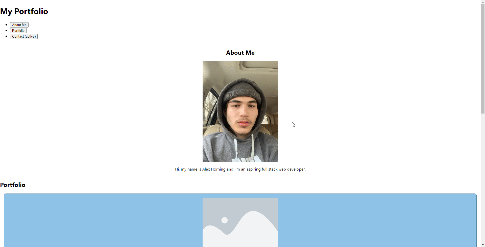

# React Portfolio

## Description
        
My developer portfolio made with react to show case porjects, and to have a place for related proffessional contact information.
 
## Table of Contents
- [Installation](#installation-installation)
- [Usage](#usage-usage)
- [License](#license-license)
- [Questions](#questions-questions)
        
## Installation {#installation}
        
To install, git clone the repo and run npm start in the root directory.

## Usage {#usage}
        
To use Webpage visit Deployed Url, explore the page with scroll wheel, and interact with Navigation Bar, and redirect to proffessional profiles with the Icons in the footer of the webpage.
        
## License {#license}
        
None

## Questions {#questions}
If you have any questions, please feel free to contact me at Alex.horning.54@gmail.com 
or check out my GitHub profile at [Makeitouthill](https://github.com/Makeitouthill).